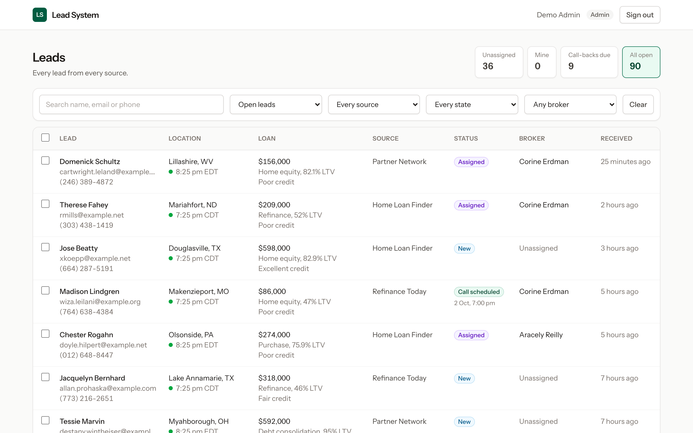
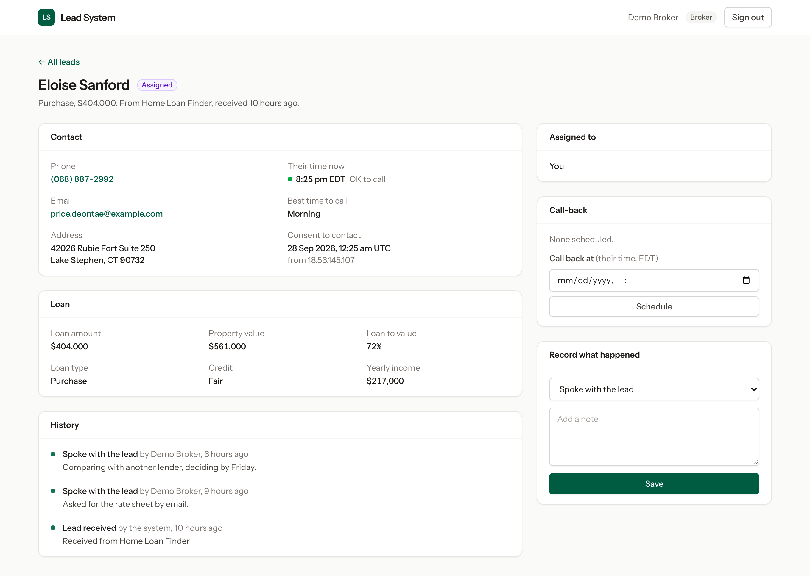
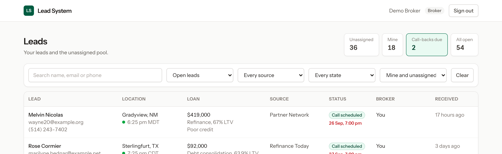

# Lead System

A mortgage lead system I first wrote in plain PHP between 2002 and 2005, rebuilt in 2026 with Laravel and Livewire.

The original took leads from a network of websites, handed them to brokers, and tracked every call-back. This repository is how I would build the same thing today. It runs on invented data and is a portfolio piece, not a product.



## Then and now

Every figure in the 2005 column was measured from the original code.

| | 2005 | 2026 |
|---|---|---|
| List, action and schedule screens | 28 files and 13,261 lines, counting the per-lender, Spanish and backup copies | 2 Livewire components and their views, 875 lines |
| A lender gets its own view | Copy the pages. `actionviewmort_lmb.php` is 95% identical to `actionviewmort.php` | Not rebuilt. It would be a filter on the one inbox |
| Where a lead came from | A `sitenum` number stamped on the lead | A `lead_sources` row with its own intake token |
| Database access | 55 files open their own connection and 42 carry the password in source | One connection, configured in `.env` |
| Lead status | `actionlevel` integers: 0, 1, 20, 30, 31, 99 | A `LeadStatus` enum |
| Time zones | A 306-row area-code table and hour offsets added by hand | A time zone stored on each lead |
| Call-backs | Day, time and sort order kept in three separate columns | One UTC timestamp, typed and shown in the lead's local time |
| History | One `action` column on the lead, overwritten each time | One row per action, with who and when |
| Passwords | Plain text | Hashed, with sign-in locked after five failed attempts |
| Versions | `_backup`, `_test`, `x_`, `.vaf` and `-3` in the file names | Git |
| Automated tests | None | 146 |

### Changing a lead

In 2005 a value from the query string went straight into the SQL. Nothing in the page escapes it.

```php
$getid = $_GET['getid'];

$query = "update $dbtable SET action = 'recycled', actiondate = '$today', actiontime = '$action_time', actionlevel = '20', lead_recycler = '$partner', x_recycleit = '$x_setlead', leadrecycled = '1' where userid = '$getid'";
```

In 2026 a broker takes a lead through one conditional update with bound parameters. If two brokers press the button at the same moment, the database gives the lead to one of them and the other is told it has gone.

```php
$claimed = Lead::query()
    ->whereKey($lead->id)
    ->whereNull('assigned_to')
    ->open()
    ->update(['assigned_to' => $broker->id]);

if ($claimed === 0) {
    return false;
}
```

### What time is it for the lead

In 2005 each page added a fixed number of hours to the server clock.

```php
$timedif = "3";
$hourdiff2 = "3" + $timedif; // hours difference between server time and local time
$timeadjust2 = ($hourdiff2 * 60 * 60);
$day_time2 = date("Hi",time() + $timeadjust2);
```

In 2026 the lead carries its own time zone and the date library does the arithmetic, daylight saving included.

```php
public function isWithinCallingHours(CarbonImmutable $at): bool
{
    $hour = $at->setTimezone($this->timezone)->hour;

    return $hour >= self::CALLING_HOURS_START && $hour < self::CALLING_HOURS_END;
}
```

## What it does

- **Receives leads** at `POST /api/v1/leads`. Each sending site has its own token.
- **Refuses a lead without consent** and records when and from which IP address consent was given.
- **Spots repeats.** The same email from the same site within 30 days returns the lead already on file.
- **Lists leads in one inbox**, filtered by search, status, source, state and owner. The filters live in the URL.
- **Separates roles.** An admin sees every lead and assigns them. A broker sees their own leads and the unassigned pool.
- **Keeps a history.** Calls, messages, notes, assignments and call-backs are each a row with a name and a time.
- **Books call-backs** in the lead's local time, and refuses any outside 8 am to 9 pm for the lead.
- **Shows what is due.** The inbox lists call-backs whose time has arrived, soonest first.





## Decisions worth a look

| Decision | Where |
|---|---|
| Two brokers cannot both take the same lead | `app/Actions/ClaimLead.php` |
| A colleague's lead answers 404, so the page does not confirm it exists | `app/Livewire/LeadDetail.php` |
| A lead handed to a colleague while your page is open sends you back to the inbox | `app/Livewire/LeadDetail.php` |
| Filter values from the URL are checked against known lists before they reach a query | `app/Livewire/LeadInbox.php` |
| A call-back typed as 31 February is refused, not rolled into March | `app/Rules/CallableTime.php` |
| Who may see, work, take and assign a lead | `app/Policies/LeadPolicy.php` |

## Run it

You need PHP 8.3 or later, Composer and Node.

```bash
composer setup
```

```bash
php artisan db:seed
```

```bash
php artisan serve
```

Then open `http://127.0.0.1:8000` and sign in with a demo account. Both use the password `password`.

| Account | Sees |
|---|---|
| `admin@example.com` | Every lead, and can assign them |
| `broker@example.com` | Their own leads and the unassigned pool |

To send a lead in, use the demo token of one of the seeded sources:

```bash
curl -X POST http://127.0.0.1:8000/api/v1/leads \
  -H 'Accept: application/json' \
  -H 'Content-Type: application/json' \
  -H 'Authorization: Bearer demo-token-S101' \
  -d '{"first_name":"Pat","last_name":"Buyer","email":"pat.buyer@example.com","phone":"(614) 555-0142","address":"12 Elm Street","city":"Columbus","state":"OH","zip":"43215","property_value":310000,"loan_amount":248000,"loan_type":"refinance","credit_rating":"good","consent":true}'
```

The first call answers `201`. Sending the same lead again answers `200` with `"duplicate": true`.

## Tests

```bash
php artisan test
```

The 146 tests cover lead intake, the inbox filters, who may see and change which lead, the race between two brokers, call logging, and call-back times across time zones and daylight saving.

## What is not here

- **The 2005 code.** It holds real people's details and live passwords, so it stays private. The excerpts above contain neither.
- **Parts of the original I left out:** sending leads on to lenders, the Spanish pages, the separate debt-lead pages, the newsletter, the link directory, affiliate sign-up, the IP lookups, the site status checker, the Excel and Word exports, the autoresponder emails and the reports.
- **Legal compliance.** Consent capture and calling hours are here to show the approach. A real lead business needs its own legal review.

## Built with

Laravel 13, Livewire 4, Tailwind CSS 4, SQLite and PHPUnit 12.
