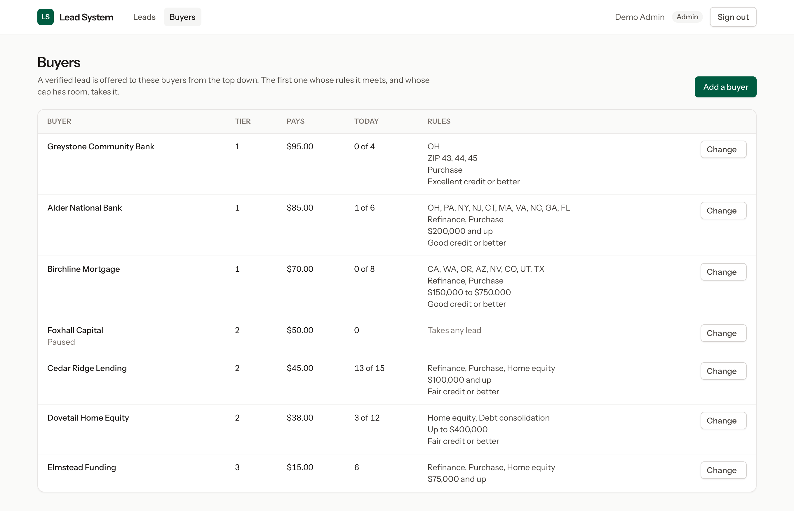

# Lead System

A 2026 rebuild, in Laravel and Livewire, of part of the lead system behind Direct Business Solutions, the mortgage lead generation company I owned and ran from 2003 to 2008.

I wrote the original in plain PHP. It captured leads from a network of websites, had a processing team verify each one by phone, matched it against every buyer's rules and routed it to the right buyer. The [case study](https://vinfetty.com/work/mortgage-lead-generation) tells that story. This repository is how I would build the same system today. It runs on invented data and is a portfolio piece, not a product.

**[Try the live demo](https://leads.vinfetty.com)**. Sign in with one click as the admin or a processor. The data resets every hour.


## The path of a lead

The case study describes seven stages. This is how much of each the rebuild covers.

| Stage | In this rebuild |
|---|---|
| Capture | `POST /api/v1/leads`, with one token per sending site |
| Qualify | Validation and recorded consent. The original's fraud and weak-lead flags are not rebuilt |
| Verify by phone | The inbox, call logging and call-backs |
| Clean | Not rebuilt |
| De-duplicate | At intake, and again at routing: a buyer never gets the same lead twice |
| Match | Each buyer's rules, checked from the best tier down |
| Route | The delivery is recorded with buyer, price and time. Nothing is sent to a real buyer |

## Then and now

Every figure in the 2005 column was measured from a copy of the original code as it stood in late 2005.

| | 2005 | 2026 |
|---|---|---|
| List, action and schedule screens | 28 files and 13,261 lines, counting the per-lender, Spanish and backup copies | 2 Livewire components and their views, 931 lines |
| A buyer's requirements | In copies of the pages, one set per lender. One lender's copy of the action page is 95% identical to the original | A row in `buyers`. An admin changes a field and the next lead is routed by it |
| Where a lead came from | A `sitenum` number stamped on the lead | A `lead_sources` row with its own intake token |
| Database access | 55 files open their own connection and 42 carry the password in source | One connection, configured in `.env` |
| Lead status | `actionlevel` integers: 0, 1, 20, 30, 31, 99 | A `LeadStatus` enum |
| Time zones | A 306-row area-code table and hour offsets added by hand | A time zone stored on each lead |
| Call-backs | Day, time and sort order kept in three separate columns | One UTC timestamp, typed and shown in the lead's local time |
| History | One `action` column on the lead, overwritten each time | One row per action, with who and when |
| Passwords | Plain text | Hashed, with sign-in locked after five failed attempts |
| Versions | `_backup`, `_test`, `x_`, `.vaf` and `-3` in the file names | Git |
| Automated tests | None | 221 |

### Changing a lead

In 2005 a value from the query string went straight into the SQL. Nothing in the page escapes it.

```php
$getid = $_GET['getid'];

$query = "update $dbtable SET action = 'recycled', actiondate = '$today', actiontime = '$action_time', actionlevel = '20', lead_recycler = '$partner', x_recycleit = '$x_setlead', leadrecycled = '1' where userid = '$getid'";
```

In 2026 a processor takes a lead through one conditional update with bound parameters. If two processors press the button at the same moment, the database gives the lead to one of them and the other is told it has gone.

```php
$claimed = Lead::query()
    ->whereKey($lead->id)
    ->whereNull('assigned_to')
    ->open()
    ->update(['assigned_to' => $processor->id]);

if ($claimed === 0) {
    return false;
}
```

### What time is it for the lead

In 2005 each page added a fixed number of hours to the server clock.

```php
$timedif = "3";
$hourdiff2 = "3" + $timedif; // hours difference between server time and local time
$timeadjust2 = ($hourdiff2 * 60 * 60);
$day_time2 = date("Hi",time() + $timeadjust2);
```

In 2026 the lead carries its own time zone and the date library does the arithmetic, daylight saving included.

```php
public function isWithinCallingHours(CarbonImmutable $at): bool
{
    $hour = $at->setTimezone($this->timezone)->hour;

    return $hour >= self::CALLING_HOURS_START && $hour < self::CALLING_HOURS_END;
}
```

### Which buyer gets the lead

The copy of the 2005 code I still have does not contain the routing engine, so there is no excerpt to set beside this one. I rebuilt matching and routing from how the business worked, as the case study describes it.

Each rule has a name. The lead's page can then say which rule sent the lead elsewhere.

```php
return match (true) {
    ! $buyer->active => SkipReason::Paused,
    $alreadySent => SkipReason::AlreadySent,
    ! $this->servesState($buyer, $lead) => SkipReason::StateNotServed,
    ! $this->servesZip($buyer, $lead) => SkipReason::ZipNotServed,
    ! $this->buysLoanType($buyer, $lead) => SkipReason::LoanTypeNotBought,
    $buyer->min_loan_amount !== null && $lead->loan_amount < $buyer->min_loan_amount => SkipReason::LoanTooSmall,
    $buyer->max_loan_amount !== null && $lead->loan_amount > $buyer->max_loan_amount => SkipReason::LoanTooLarge,
    $buyer->min_credit_rating !== null && ! $lead->credit_rating->meets($buyer->min_credit_rating) => SkipReason::CreditTooLow,
    $buyer->daily_cap !== null && $deliveredToday >= $buyer->daily_cap => SkipReason::CapReached,
    default => null,
};
```

## What it does

- **Receives leads** at `POST /api/v1/leads`. Each sending site has its own token.
- **Refuses a lead without consent** and records when and from which IP address consent was given.
- **Spots repeats.** The same email from the same site within 30 days returns the lead already on file.
- **Lists leads in one inbox**, filtered by search, status, source, state and owner. The filters live in the URL.
- **Separates roles.** An admin sees every lead, assigns them and sets the buyers' rules. A processor sees their own leads and the unassigned pool.
- **Keeps a history.** Calls, messages, notes, assignments and call-backs are each a row with a name and a time.
- **Books call-backs** in the lead's local time, and refuses any outside 8 am to 9 pm for the lead.
- **Shows what is due.** The inbox lists call-backs whose time has arrived, soonest first.
- **Routes a verified lead** to the best buyer whose rules it meets and whose daily cap has room.
- **Explains every routing.** The lead's page shows who took the lead, at what price, and why each other buyer did not.
- **Keeps a rejected bucket** for verified leads that no buyer could take.





## Decisions worth a look

| Decision | Where |
|---|---|
| Two processors cannot both take the same lead | `app/Actions/ClaimLead.php` |
| One lead is routed at a time, so two leads cannot both take a buyer's last place under its cap | `app/Actions/RouteLead.php` |
| A buyer can never be sent the same lead twice, enforced by a unique index | `database/migrations` |
| Routing decisions are stored as they were worded at the time, because rules and caps change afterwards | `app/Models/RoutingAttempt.php` |
| A buyer's cap counts from midnight where the business is, not where the server is | `app/Models/Buyer.php` |
| A colleague's lead answers 404, so the page does not confirm it exists | `app/Livewire/LeadDetail.php` |
| A lead handed to a colleague while your page is open sends you back to the inbox | `app/Livewire/LeadDetail.php` |
| Filter values from the URL are checked against known lists before they reach a query | `app/Livewire/LeadInbox.php` |
| A call-back typed as 31 February is refused, not rolled into March | `app/Rules/CallableTime.php` |
| The command that wipes the demo refuses to run unless demo mode is on | `app/Console/Commands/ResetDemo.php` |

## Run it

You need PHP 8.3 or later, Composer and Node.

```bash
composer setup
```

```bash
php artisan db:seed
```

```bash
php artisan serve
```

Then open `http://127.0.0.1:8000` and sign in with a demo account. Both use the password `password`.

| Account | Sees |
|---|---|
| `admin@example.com` | Every lead, and the buyers and their rules |
| `processor@example.com` | Their own leads and the unassigned pool |

To sign in with one click, set `DEMO_MODE=true` in `.env`.

To send a lead in, use the demo token of one of the seeded sources:

```bash
curl -X POST http://127.0.0.1:8000/api/v1/leads \
  -H 'Accept: application/json' \
  -H 'Content-Type: application/json' \
  -H 'Authorization: Bearer demo-token-S101' \
  -d '{"first_name":"Pat","last_name":"Buyer","email":"pat.buyer@example.com","phone":"(614) 555-0142","address":"12 Elm Street","city":"Columbus","state":"OH","zip":"43215","property_value":310000,"loan_amount":248000,"loan_type":"refinance","credit_rating":"good","consent":true}'
```

The first call answers `201`. Sending the same lead again answers `200` with `"duplicate": true`.

## Tests

```bash
php artisan test
```

The 221 tests cover lead intake, the inbox filters, who may see and change which lead, the race between two processors, call logging, call-back times across time zones and daylight saving, every buyer rule, caps, tier fallback, the rejected bucket and demo mode.

## Demo mode

Setting `DEMO_MODE=true` prepares the app to be shown in public:

- The sign-in page offers one-click sign-in as the admin or a processor.
- A banner on every page says the data is invented.
- Search engines are asked to stay away.
- The database is rebuilt with fresh invented data every hour.

Never turn it on where there are real leads. The hourly rebuild deletes everything.

## Hosting the demo

The workflow in `.github/workflows/test-and-deploy.yml` tests every push. On `main` it also deploys to a Cloudways application. The server never runs Composer or npm: the code arrives with `vendor/` and `public/build/` already built.

One-time setup:

1. **Cloudways:** create a PHP application, set its web root to `public_html/public`, add the domain and turn on SSL.
2. **Cloudways:** turn Varnish off for the application, because the pages depend on who is signed in.
3. **Cloudways:** add a cron job that runs every minute, so the hourly reset happens:
   `cd /path/to/public_html && php artisan schedule:run`
4. **GitHub:** add the secrets `CW_HOST`, `CW_USER`, `CW_SSH_KEY` and `CW_APP_PATH`, then set the variable `DEPLOY_ENABLED` to `true`.

The first deploy writes a `.env` for the demo on the server. Later deploys leave it alone.

## How this was built

I wrote the original by hand. The 2026 rebuild was written with Claude Code, an AI coding assistant, working to my direction.

## What is not here

- **The 2005 code.** It holds real people's details and live passwords, so it stays private. The excerpts above contain neither.
- **Parts of the original I left out:** delivery to a buyer's own systems, selling one lead to several buyers, fraud and weak-lead flags, data cleaning, the Spanish pages, the separate debt-lead pages, the newsletter, the link directory, affiliate sign-up, the IP lookups, the site status checker, the Excel and Word exports, the autoresponder emails and the reports.
- **Real names.** Every lead, buyer and source in the demo data is invented.
- **Legal compliance.** Consent capture and calling hours are here to show the approach. A real lead business needs its own legal review.

## Built with

Laravel 13, Livewire 4, Tailwind CSS 4, SQLite and PHPUnit 12.

## Licence

Released under the [MIT licence](LICENSE).
